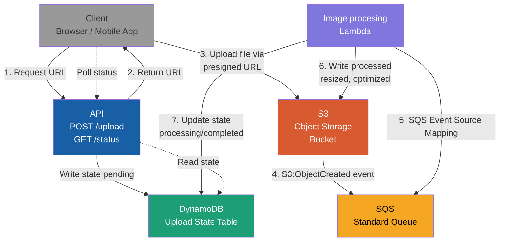
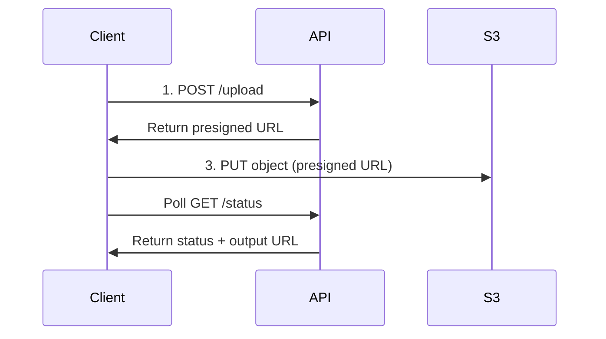

# Image Processor - Design

## Table of Contents

<!--TOC-->

- [Objective](#objective)
- [Non-goals](#non-goals)
- [Architecture — Tech Stack](#architecture--tech-stack)
- [Architecture Diagram](#architecture-diagram)
- [API Definition](#api-definition)
- [User Flow](#user-flow)
- [Worker Flow](#worker-flow)
- [Error Handling & Retry Strategy](#error-handling--retry-strategy)
- [Persistence & State Transitions](#persistence--state-transitions)
- [S3 Key Convention](#s3-key-convention)
- [Image Resizing Strategy](#image-resizing-strategy)
  - [Edge cases](#edge-cases)
- [Serving processed images](#serving-processed-images)
- [Non-Functional Requirements](#non-functional-requirements)

<!--TOC-->

## Objective

Build a service for uploading and serving optimized images for web applications handling resizing and format conversion automatically.

## Non-goals

Support for anything other than images. This is not a media processor.

## Architecture — Tech Stack

- CDK
- Github Actions
- Python 3.14, uv
- AWS Lambda Powertools, Pillow

## Architecture Diagram



## API Definition

`POST upload`

Response:

```json
{
    "image_id": "server side generated guid",
    "upload_url": "presigned url to upload source image"
}
```

`GET status/{guid}`

Response:

```json
{
    "status": "pending|processing|complete|failed",
    "images": {
        "thumb": "https://thumbnail-uri",
        "full": "https://full-uri"
    }
}
```

## User Flow

- Request a presigned url
- Poll a status endpoint
- On complete response will include urls for thumb and large image



## Worker Flow

- S3 put events written to an SQS queue
- Lambda event source for the queue
- Loads and resizes images

## Error Handling & Retry Strategy

- SQS DLQ
- Handle unsupported images by marking as failed in SQS - Does that put them back in the queue for another round?

## Persistence & State Transitions

- User requests an upload URL
- Record written to DDB recording the generated guid and pending status
- Processor lambda gets S3 put events via SQS, it sets processing
- When done, it sets complete
- Update logic needs to support going right from pending to complete even if that won't happen in this implementation
- TTL on records

## S3 Key Convention

`uploads/{guid}` - original image
`processed/{guid}/thumb.webp`
`processed/{guid}/display.webp`

## Image Resizing Strategy

- Fixed width for thumbs and display
- 80% original quality
- WebP

Choosing fixed with so that if displayed in a row, or grid, the images will be aligned horizontally.

### Edge cases

If an image is smaller than the default min width, it will be left unchanged. Extremely large images (how large is large?) should be rejected.

## Serving processed images

Cloudfront

## Non-Functional Requirements

- Alarms on SQS queue and DDB table records to flag errors
